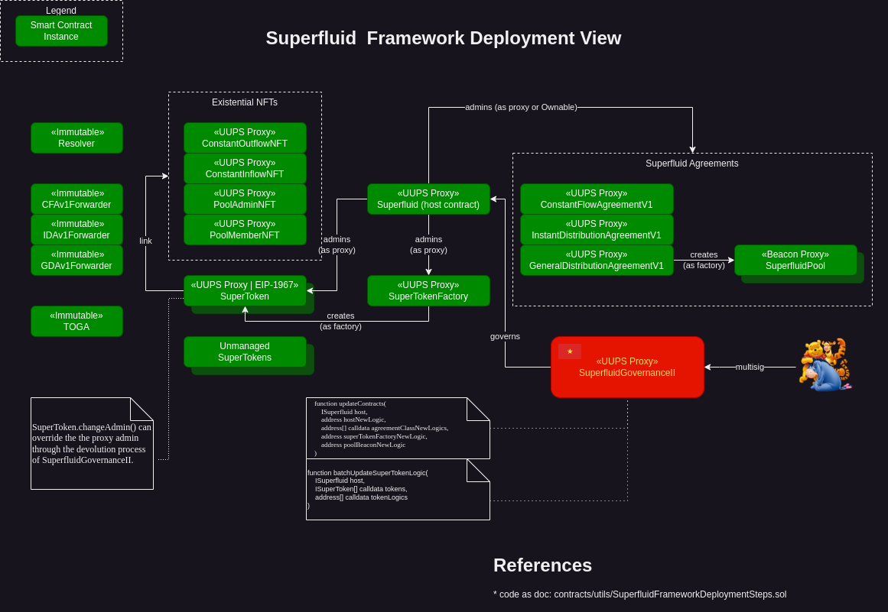

# Superfluid Plugin Ideathon Proposal

## Overview

The Superfluid Plugin aims to streamline interactions with Superfluid protocol contracts by providing pre-defined ABIs for core contracts such as cfav1, cfav1Forwarder, host, and idav1. This plugin will simplify the process of integrating Superfluid functionality into decentralized applications by removing the need for manual ABI search and contract initialization, also, it could save gas since the plugin can interact directly with the `host` contract instead of devs interacting with `forwarder` which interacts with the `host` contract.

## Features

### Storage

1. **ABIs**

   - ABI of cfav1Forwarder
   - ABI of host

### Functions

#### `cfav1Forwarder()`

- **Description:** Initializes a contract instance for Superfluid's CFAV1Forwarder.
- **Steps:**
  1. Check if the provided address is valid.
  2. Create a contract instance using the provided address and the stored ABI for CFAV1Forwarder.
  3. Link the contract instance to the plugin and return it.

#### `host()`

- **Description:** Initializes a contract instance for Superfluid's Host.
- **Steps:**
  1. Check if the provided address is valid.
  2. Create a contract instance using the provided address and the stored ABI for Host.
  3. Decode parameters and interact with the contract.

## Category

- [] Community Plugin
- [x] Project Plugin: Superfluid

## Usage (Before & After Plugin)

Before integrating the plugin, developers need to manually search for contract ABIs and addresses, leading to a time-consuming process. However, with the Superfluid Plugin, developers can seamlessly initialize contract instances and execute transactions by simply providing the contract addresses, thereby enhancing the development workflow.
Before the plugin, developers needed to send complex(decoded) parameters to the `host` or to avoid this parameters, they can talk to `forwarder` (which will be a double-tx/call), so using the plugin, develeopers can talk now to the `host` and the decoding/logic is happening inside the plugin.

## Use case:

- [x] Developer Experience: The Superfluid Plugin improves the developer experience by eliminating the need for manual ABI search and contract initialization, leading to better DevEx.
- [x] Gas optimization: By allowing direct interaction with the `host` contract, the Superfluid Plugin can potentially optimize gas usage by eliminating the need for intermediary transactions via the `forwarder`.

## Optional:

[Superfluid overview](https://github.com/superfluid-finance/protocol-monorepo/wiki/Superfluid-Protocol-V1-Overview)

